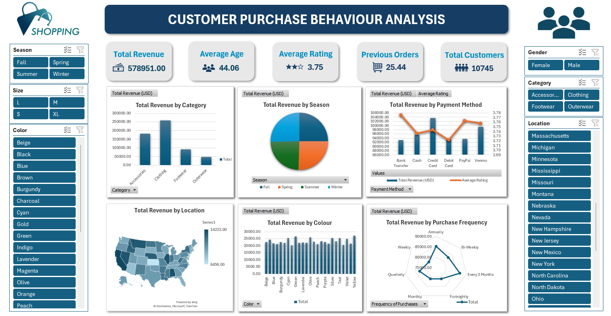
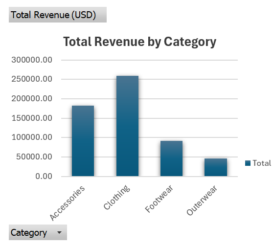
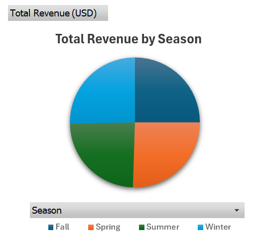
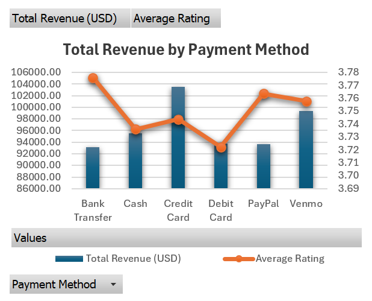
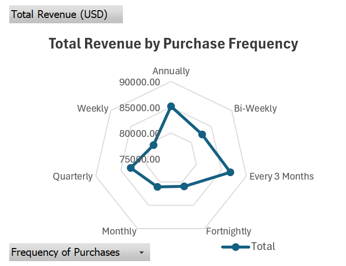
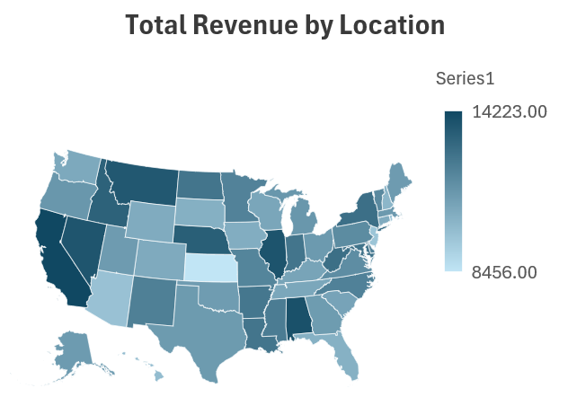

# Shobi customer behaviour analysis (summary ver)

**Timeframe:** 21 January 2023 – 21 July 2024  
**Location:** United States  
**Dataset size:** 10,745 online transactions  
**Tools:** Microsoft Excel (PivotTables, Slicers, Calculated Fields, Charts)

---

## Project structure
```text
purchasebehaviour_dashboard/
├── README.md
├── .gitignore
├── data/
│   ├── raw/
│   │   └── purchasebehaviour_data.xlsx
│   └── processed/
│       └── purchasebehaviour_processeddata.xlsx
├── docs/
│   ├── purchasebehaviour_dashboard.png
│   ├── dataset_description.md
│   ├── workflow_notes.md
│   └── visualisations/
│       ├── revenue_bycategory.png
│       ├── revenue_byseason.png
│       ├── revenue_byfrequency.png
│       ├── revenue_bylocation.png
│       └── revenue_bypaymentmethod.png
└── reports/
    └── purchasebehaviour_dashboard.xlsx
```

## Project resources

The original dataset used for this analysis is stored [here](data/raw/purchasebehaviour_data.xlsx)  
The cleaned and transformed dataset is available [here](data/processed/purchasebehaviour_processeddata.xlsx)  
The Excel analysis and dashboard can be downloaded [here](reports/purchasebehaviour_dashboard.xlsx)  

Additional documentation  
- Dataset deécription [here](docs/dataset_description.md)  
- Workflow notes [here](docs/workflow_notes.md)  

All charts used in the dashboard are stored [here](docs/visualisations/)  

## Dashboard overview

The final Excel dashboard combines KPIs, charts, and slicers into a single interactive interface:  
- KPI cards show live Total Revenue, Average Age, Average Rating, Prevous Orders, and Total Customers.  
- Slicers allow filtering by Category, Season, Location, Gender, Size and Color.  
- Charts update dynamically for instant comparison and exploration.  



---

## Executive summary

This project provides an analysis of online purchasing behavior for a simulated US e-commerce retailer called Shobi. The aim is to identify the factors driving sales performance, customer satisfaction, and repeat purchases over an 18-month period. The analysis examines how elements such as seasonality, product categories, payment methods, and purchase frequency influence overall sales trends.

Below is a summary of findings and recommendations.

---

## Business context

The simulated US e-commerce retailer called Shobi sells Clothing, Footwear, Accessories, and Outerwear nationwide.  
Like most online retailers, it faces challenges in customer retention, seasonal fluctuations, and payment experience satisfaction.

Business questions included:
- Which products generate the most revenue during each season?  
- Are customers satisfied with their payment experience?  
- How often do repeat customers return, and what is their contribution to revenue?  
- Which U.S. regions outperform others in sales and ratings?  

---

## Findings and insights

**Product category performance**

Across all 10,745 online transactions, Clothing dominates revenue generation with $258,924 (44.7%), making it the strongest sales driver in the store’s product mix.  
Accessories come second with $182,490 (31.5%), followed by Footwear ($91,234 | 15.8%) and Outerwear ($46,303 | 8.0%).  



While Clothing and Accessories together account for over 75% of total revenue, their customer ratings are only moderate (around 3.7–3.8), implying potential for quality or delivery improvements.  
Footwear and Outerwear have smaller revenue shares but could represent premium or niche segments worth nurturing through targeted ads.

- Clothing is the core revenue engine, seasonal restocks and trend-driven promotions here would yield high ROI.  
- Accessories, though lower in absolute value, have consistent demand and are ideal for bundling offers (“Buy 2 get 1” or “Add-on discounts”).  
- Outerwear sales spike in colder months (see Seasonality below), suggesting inventory planning and winter marketing should start by late October.

**Seasonality and sales distribution**

Revenue is evenly distributed across the year but shows a mild upward trend in Spring ($147,677 | 25.5%) and Winter ($146,519 | 25.3%), with Fall ($144,634) and Summer ($140,121) slightly behind.  



These seasonal swings may correspond to holiday and sale cycles (e.g., Winter sales, Spring fashion launches). Customer ratings are slightly higher in Summer (≈3.8), possibly due to smoother logistics or lighter product types.

- The store’s demand pattern is stable, no severe off-season slump, which indicates good product diversification.  
- Still, targeted promotions in June and November could exploit natural spending peaks.  
- Winter products (Outerwear, long sleeves) should be advertised one quarter ahead (September–October).

**Payment method behavior**

Credit Card transactions dominate with $103,555 in revenue across ~1,922 orders, confirming it as the preferred payment option.  
Cash on Delivery (COD) is the second most common, while PayPal, Venmo, and Bank Transfer make up smaller portions.

Interestingly, Bank Transfer has the highest customer rating (3.78), suggesting those customers may be older or more deliberate shoppers who appreciate reliability.  
Venmo and PayPal have slightly lower satisfaction (3.6–3.7), hinting at UX or refund delays.



- The payment distribution shows a healthy digital adoption level.  
- Digital wallet users (PayPal/Venmo) tend to make higher-value purchase, optimising checkout design for these users could increase conversions.  
- Promoting instant payment discounts could shift COD users to faster, more secure methods.

*Customer satisfaction was evaluated using the single column Review Rating, which assigns a 1–5 score per transaction.  
For analysis, average ratings were computed across different dimensions (Category, Season, and Payment Method) to identify which factors most influence satisfaction levels.*

**Purchase frequency and customer loyalty**

Analysing `Frequency of Purchases`, the strongest spending segments are:
- Every 3 Months – $86.8K  
- Annually – $85.2K  
- Quarterly – $83.0K  
- Bi-Weekly – $82.6K  
- Monthly – $81.1K  



While the Every 3 Months cohort is the top contributor, the close gaps between groups indicate broad repeat engagement across the customer base.  
All customers have nonzero previous purchases, confirming that this dataset represents repeat buyers, an interesting sign of strong retention in the model.

- Customers show predictable recurring patterns, ideal for automated remarketing.  
- Loyalty campaigns (e.g., reminders or rewards at the 3-month mark) could reinforce these cycles.  
- Segmenting customers by purchase frequency allows for better personalisation and inventory planning.

**Geographic insights**

The East Coast (especially California, New York, New Jersey, and Florida) leads the revenue chart, with California alone generating $14,223.  
High-population states dominate sales, suggesting marketing spend has been concentrated effectively.  
However, some midwestern states show moderate revenue but lower satisfaction (≈3.5 rating), possibly due to shipping delays.



- East Coast customers appear both active and consistent, keep logistics optimised for these zones.  
- Expanding same-day or 2-day delivery to top states could lift satisfaction metrics.  
- Geographic segmentation could inform targeted promotions (e.g., weather-based recommendations).

**Overall observations**

- Revenue concentration: 76% of revenue comes from just two categories, a sign of strength but also a risk of overreliance.  
- Customer satisfaction: Average rating (3.75) suggests room for improvement, likely in delivery speed or product consistency.  
- Payment & loyalty: Repeat buyers and digital payment users represent the store’s most valuable segments.  
- Actionable takeaway: Retain frequent buyers, improve UX for mobile payments, and optimise seasonal campaigns by region and category.

---

### Summary of recommendations
| Focus area | Action | Expected impact |
|-------------|--------|-----------------|
| Retention | Introduce automated reminders and loyalty tiers for frequent buyers | Increased repeat rate |
| Marketing | Focus on Clothing & Accessories, seasonal campaigns in Spring/Winter | Revenue growth & balanced seasonality |
| Payment UX | Streamline PayPal/Venmo flows, incentivize instant payments | Higher conversion & satisfaction |
| Operations | Prioritise inventory for East Coast, pre-plan winter stock | Faster fulfillment, higher ratings |
| Customer experience | Gather reviews post-delivery to monitor satisfaction trends | Continuous improvement loop |
